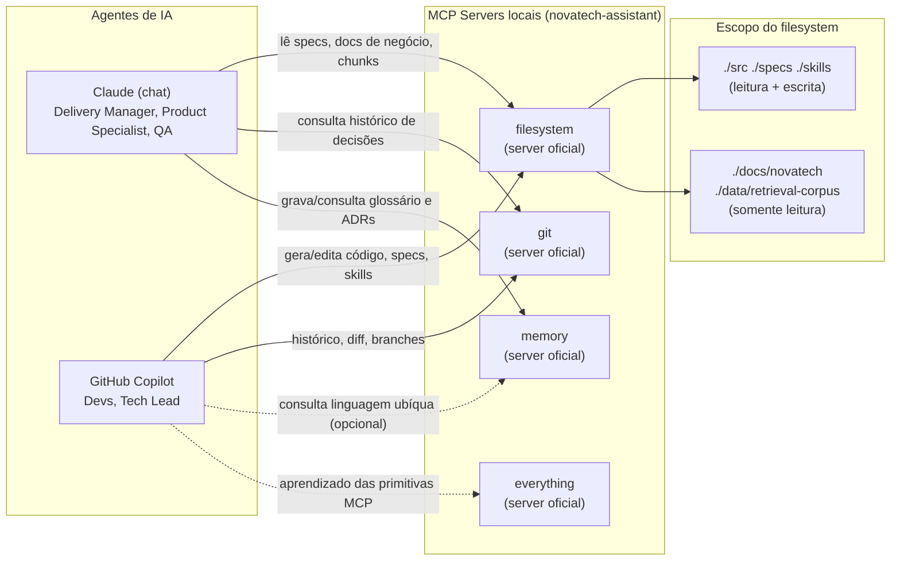

# Arquitetura de MCP — NovaTech Assistant

> Exercício 2.2 (Tech Lead), Tarefa 1. Documento de arquitetura dos MCP servers locais do projeto: quais são, com qual escopo, como são aprovados, monitorados e versionados.

## Contexto

O mapeamento inicial de necessidades foi feito pelo Dev (Exercício 2.1 — Dev):

```
Servers locais e gratuitos:
(1) filesystem  -> ./src ./specs ./skills (rw) + ./docs/novatech ./data/retrieval-corpus (read-only)
(2) git         -> repositório local (histórico, diff, branches)
(3) memory      -> grafo persistente de decisões e linguagem ubíqua
(4) everything  -> aprendizado das primitivas de MCP
```

Como Tech Lead, meu papel aqui não é redefinir esses servers, e sim tratá-los como **infraestrutura do projeto**: decidir quem pode consumir cada um, com qual escopo, como aprovar mudanças, como detectar quando um server falha, e como evoluir o `.mcp/mcp.json` sem quebrar quem já depende dele.

Todos os servers abaixo são *reference servers* do protocolo MCP, executados localmente via `npx`/`uvx`, sem custo e sem dependência de serviço externo — conforme já estabelecido no Anexo C e no Anexo D (Starter Repo). Nenhum deles expõe rede além do `localhost`; a superfície de risco é inteiramente sobre **escopo de arquivos e permissões**, não sobre rede.

---

## 1. Diagrama dos servers e conexões com os agentes



### Quem consome o quê, e com qual escopo

| Server | Consumido por | Escopo concedido | Tipo de acesso | Por que esse é o escopo mínimo |
|---|---|---|---|---|
| `filesystem` | Copilot (Devs, Tech Lead), Claude (todos os papéis) | `./src`, `./specs`, `./skills` | leitura + escrita | São os únicos diretórios onde agentes precisam **gerar** artefatos (código, specs, skills). |
| `filesystem` | Copilot, Claude | `./docs/novatech`, `./data/retrieval-corpus` | **somente leitura** | Substituem Confluence/Azure AI Search nesta fase — são fonte de verdade de negócio; nenhum agente deve poder alterar documentação da NovaTech ou o corpus de chunks. |
| `git` | Copilot, Claude | repositório local (`.git`), sem escopo de pasta adicional | leitura de histórico/diff/branches | Nenhum agente deve dar `push`/force-push sozinho — a regra é o agente **ler** contexto (o que mudou, por quem), não decidir sobre o repositório remoto (que nesta fase nem existe). |
| `memory` | Claude (Delivery Manager, Product Specialist, QA), Copilot (consulta) | grafo local persistente | leitura + escrita | É onde a linguagem ubíqua e decisões (ex.: "Gold é tier, não metal") ficam disponíveis entre sessões — sem isso, cada sessão de agente reaprende do zero. |
| `everything` | Copilot, Claude (qualquer papel, uso pontual) | nenhum (não toca no filesystem do projeto) | n/a | Existe só para o time aprender as primitivas de MCP (tools/resources/prompts) — não deve ficar habilitado permanentemente em uso de produção do projeto. |

**Princípio geral:** nenhum server recebe escopo em `./` (raiz do projeto). Cada server recebe exatamente as pastas que sua função exige, e as fontes de negócio (`docs/novatech`, `data/retrieval-corpus`) nunca recebem escrita — nem para os papéis que mais precisam delas (Product Specialist, QA).

---

## 2. Política de aprovação de novos servers

Adicionar ou alterar um server no `.mcp/mcp.json` do projeto segue este fluxo:

1. **Quem pode propor:** qualquer papel do time (Dev, QA, Product Specialist, Delivery Manager) pode propor um novo server ou uma mudança de escopo em um existente.
2. **Como propor:** abrir uma branch local `feature/mcp-<slug>` e descrever a proposta em `docs/pull-requests/PR-NNNN.md` (mesmo formato usado para código, já que nesta fase não há PR real no GitHub). A descrição **deve** conter:
   - Qual necessidade o server resolve (ex.: "precisamos ler chunks para recuperação").
   - Escopo exato solicitado (pastas, leitura/escrita).
   - Por que o escopo pedido é o mínimo suficiente (o Anexo C já exige essa justificativa para os servers atuais — a mesma régua vale para novos).
3. **Quem aprova:** o **Tech Lead** é o único aprovador de mudanças no `.mcp/mcp.json` — é uma decisão de infraestrutura, análoga a aprovar uma mudança de IAM. O Tech Lead verifica:
   - O escopo pedido é o menor possível para a necessidade descrita (least privilege).
   - Nenhuma pasta com segredos (`.env`, credenciais, chaves) entra no escopo de um `filesystem` server.
   - Se o server pede escrita em `docs/novatech` ou `data/retrieval-corpus`, a proposta é **rejeitada por padrão** — essas pastas são fonte de verdade de negócio e read-only é a regra, não a exceção.
   - Se o server é pago/externo (não é um *reference server* local), a proposta é rejeitada nesta fase do projeto (ver Anexo D — nenhum serviço pago ou externo é permitido).
4. **Como formalizar:** aprovado, o Tech Lead atualiza o `.mcp/mcp.json` na branch e registra a decisão como ADR em `/docs/adr/` se a mudança for estrutural (ex.: adicionar um novo tipo de server) — mudanças de escopo pontuais (ex.: adicionar uma subpasta ao `filesystem`) não precisam de ADR, só da descrição no PR-markdown.
5. **Prazo:** o Tech Lead tem até 1 dia útil para aprovar/rejeitar uma proposta de mudança de MCP — é um bloqueador para quem propôs, então não fica na fila de revisões de código.

---

## 3. Monitoramento

Como todos os servers rodam localmente (não são serviços gerenciados), "monitorar" aqui significa **verificar de forma ativa e recorrente** que cada server processo:

- **Está no ar:** o processo do server (`npx @modelcontextprotocol/server-filesystem ...`, `uvx mcp-server-git ...`) responde ao handshake MCP inicial.
- **Ainda enxerga o escopo esperado:** o `filesystem` server, especificamente, deve conseguir listar `./docs/novatech` e `./data/retrieval-corpus` — se a pasta foi movida, renomeada, ou apagada (como já aconteceu neste projeto), o server continua "no ar" mas retorna erro ou lista vazia ao tentar acessar o escopo, o que é silenciosamente perigoso: o agente pode interpretar "lista vazia" como "não há documentação" em vez de "o server perdeu acesso".

Mecanismo concreto (implementado na Tarefa 2 deste exercício): um **script de health check** (`scripts/mcp-health-check.*`) que, para cada entrada de `.mcp/mcp.json`:
1. Inicia o server.
2. Solicita a lista de tools/resources expostos.
3. Para o `filesystem`, faz uma leitura de teste em cada escopo declarado (ex.: listar `docs/novatech/`) e falha explicitamente se o escopo não responder.
4. Imprime um relatório PASS/FAIL por server.

**Validação empírica (execução real, Tarefa 3):** ao simular a perda do escopo `docs/novatech` (pasta renomeada), a primeira versão do script reportou `PASS` mesmo com o filesystem server retornando `"Access denied - path outside allowed directories"` — o código só checava `text.length > 0`, e uma mensagem de erro também é texto não-vazio. Esse falso-positivo é exatamente o risco descrito no parágrafo acima ("silenciosamente perigoso"), só que no próprio mecanismo de monitoramento. Correção aplicada em `scripts/mcp-health-check.mjs`: o check agora também exige `response.isError !== true`. Reexecutado o cenário após a correção, o script passou a reportar `FAIL filesystem` / `SUMMARY 3/4 servers passed` / exit code 1 corretamente. Saída completa de execução (baseline, falha antes da correção, falha depois da correção, e uma execução adicional contra a cópia rastreada sem `.git` próprio — reproduzindo de verdade o cenário "git indisponível"): [`health-check-execucao.md`](./health-check-execucao.md). Análise de contingência (Tarefa 3): [`plano-contingencia-mcp.md`](./plano-contingencia-mcp.md).

*(Nota de reexecução: esta seção descrevia originalmente uma execução sem nenhum artefato de suporte no repositório — nem o script nem o `.mcp/mcp.json` existiam. Ambos foram implementados e o ciclo completo foi reexecutado de verdade; ver a nota no topo de `health-check-execucao.md` para o achado adicional sobre resolução de paths relativos, não previsto nesta versão original do texto.)*

Esse script deve ser executado:
- Manualmente, sempre que alguém perceber respostas estranhas de um agente (ex.: "não encontrei nenhum documento" quando deveria haver).
- Como parte do checklist de onboarding (`docs/onboarding.md`) — todo novo membro do time roda o health check antes da primeira sessão com agente.
- Idealmente, como um passo do CI local antes de sessões longas de pareamento com IA (não é um gate de CI real nesta fase, já que os servers são locais e não sobem em pipeline).

**Sinal de degradação a observar no dia a dia (sem rodar o script):** se um agente citar uma fonte que não existe, disser "não encontrei" para algo que deveria estar indexado (isso é literalmente o Incidente #3 do Exercício 2.2 do Product Specialist), ou parar de sugerir edições em `/skills`, isso é sinal de que o `filesystem` server pode ter perdido escopo — o time trata isso como um incidente de infraestrutura, não como "o modelo alucinou".

---

## 4. Versionamento

O `.mcp/mcp.json` é um arquivo versionado no Git como qualquer outro artefato de infraestrutura do projeto. Regras:

- **Toda mudança de escopo é uma mudança de comportamento dos agentes** — por isso nunca é feita direto na branch principal local; segue o fluxo de aprovação da seção 2.
- **Compatibilidade retroativa por padrão:** ao mudar o escopo de um server existente, a mudança deve ser **aditiva** sempre que possível (adicionar uma pasta ao escopo) em vez de **restritiva** (remover uma pasta) sem aviso. Uma mudança restritiva (ex.: remover `./skills` do escopo de escrita do `filesystem`) exige:
  - Aviso prévio ao time (mensagem no canal do projeto ou nota em `docs/onboarding.md`).
  - Verificação de que nenhum fluxo de agente em uso depende do escopo removido (ex.: uma skill que instrui o Copilot a escrever em `./skills/` pararia de funcionar).
- **Rastreabilidade:** cada mudança no `.mcp/mcp.json` é um commit isolado com mensagem Conventional Commits (`chore(mcp): ...` ou `feat(mcp): ...`), nunca misturada com mudanças de código de produto — isso permite usar `git log -- .mcp/mcp.json` (via o próprio `git` MCP server) para auditar a evolução do escopo dos servers ao longo do projeto.
- **Um arquivo de exemplo sempre atualizado:** `.mcp/mcp.example.json` (já presente no repositório) é mantido em paridade estrutural com `.mcp/mcp.json` real, mas sem qualquer dado sensível — serve de referência para quem for configurar o ambiente do zero e de "diff de intenção" ao revisar uma proposta de mudança.
- **Sem mudanças silenciosas de versão do server:** os comandos (`npx @modelcontextprotocol/server-filesystem`, `uvx mcp-server-git`) resolvem a versão mais recente disponível por padrão; se o comportamento de um server mudar após uma atualização upstream (o Anexo C já alerta que os nomes/comandos evoluem), isso é tratado como uma proposta de mudança normal (seção 2), não como algo que passa despercebido — o Tech Lead confirma no README oficial do `modelcontextprotocol/servers` antes de aceitar qualquer atualização de comando/versão.

---

## Resumo executivo

| Dimensão | Decisão |
|---|---|
| Diagrama | 4 servers locais (`filesystem`, `git`, `memory`, `everything`); `filesystem` é o único com escopo diferenciado (rw em código/specs/skills, read-only em docs/corpus). |
| Aprovação | Tech Lead é o único aprovador; proposta via PR-markdown com justificativa de least privilege; rejeição por padrão de escrita em fontes de negócio ou de servers pagos/externos. |
| Monitoramento | Script de health check (Tarefa 2) roda o handshake + teste de leitura por escopo; validado empiricamente (achou e corrigiu um falso-positivo real); sinal informal de degradação é o próprio comportamento do agente (respostas "não encontrado" inesperadas). |
| Versionamento | `.mcp/mcp.json` versionado no Git, mudanças aditivas por padrão, mudanças restritivas exigem aviso prévio, commits isolados e rastreáveis via `git log`. |
| Contingência | Ver [`plano-contingencia-mcp.md`](./plano-contingencia-mcp.md) (Tarefa 3): matriz de degradação por server, regra geral "agente degradado > agente quebrado", e evidência real de teste de falha. |
